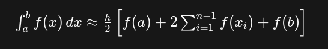

# Introdução à Cinemática

Na física, a velocidade é a taxa de variação da posição em relação ao tempo, enquanto a aceleração é a taxa de variação da velocidade em relação ao tempo. Matematicamente, a velocidade é a derivada da primeira da posição em relação ao tempo, e a aceleração é a derivada segunda da velocidade em relação ao tempo. O mesmo pode ser feito integrando as funções para fazer o "caminho contrário". Esse conceito foi aplicado para o código do `old_plot_graphic.py`.

ALém disso, foi utilizado um método para usar com os dados de coordenadas extraídos da digitalização dos gŕaficos (feita pelo software Engauge Digitizer). Ele permitiu plotar os valores no `new_plot_graphic.py` e o método de integração trapezoidal permitiu calcular a área do gráfico. Os gráficos a serem digitalizados foram retirados do livro do Halliday.

## Cálculo numérico

O método do trapézio é uma técnica de integração numérica utilizada para estimar o valor de uma integral definida. Ele funciona aproximando a área sob uma curva por meio de trapezoides, em vez de retângulos (como no método dos retângulos), o que pode fornecer uma melhor estimativa, especialmente para funções que não são lineares.

O método do trapézio envolve dividir a área sob a curva em segmentos de largura igual e aproximar cada segmento por um trapézio, calculando a área de cada trapézio e somando essas áreas para obter uma estimativa da integral.

    

##

### Sobre o código

Posteriormente, os arquivos .csv foram lidos em um código chamado `create_arrays.py` que utiliza a biblioteca Pandas e armazena os dados em estruturas tabulares. Ele leu os dados de velocidade, posição e aceleração dos arquivos .csv, removendo os valores nulos e armazenando os dados em arrays numpy. 

O `new_plot_graphic.py`  é o código atualizado que utiliza métodos de cálculo numérico para resolver os gráficos, ao invés de utilizar o método que foi feito no outro trabalho – que era o método utilizado no `old_plot_graphic.py`, ainda que esse seja possível de rodar no terminal e plotar as mesmas curvas.

Esse novo código também usa as bibliotecas Matplotlib.pyplot e Rich_menu, que são responsáveis por fazer o plot e exibir o menu de terminal mais atraente, e o módulo anteriomente citado.

Os arquivos .csv podem ser acessados na pasta csv. Na pasta src estão os códigos do plot e da interface que usa em maior parte o Customtkinter. 

Além disso, existe uma subpasta chamada `simulation-of-movement` com o `arquivo block-velocity`, que possui a biblioteca Pygame, que torna possível passar um valor de aceleração na simulação de um elevador e exibir as consequências disso graficamente. Não houve grandes aprofundamentos nessa simulação, visto que o foco estava na aplicação da ferramenta de digitalização e da integral numérica.

A imagem do elevador foi retirada no  - <a href="https://www.flaticon.com/br/icones-gratis/lift" title="lift ícones">Flaticon</a>

